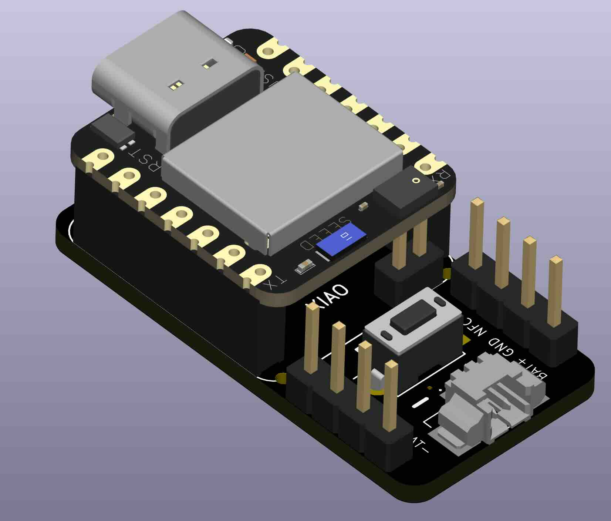
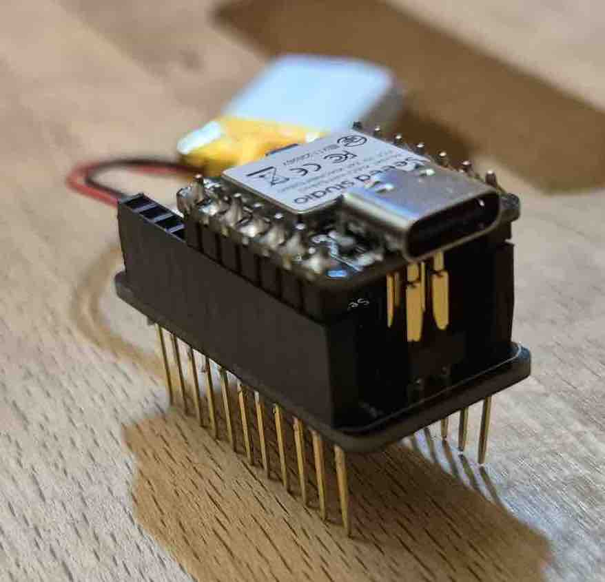
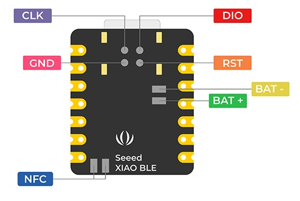

# Seeed XIAO nRF52840 breakout board

> [!WARNING]
> The information and material (code, designs, files, ...) are provided "AS IS". We make no representation or warranty of any kind, express or implied, regarding the accuracy, adequacy, validity, reliability, availability, or completeness of any information or material. Use this at your own risk.

> [!WARNING]
> Note that some batteries have a "reversed" plug with the positive and negatives wires switched, so always make sure that the polarity matches the indications on the board, before plugging anything in!

## Introduction

This repository contains a small breakout board for the Seeed XIAO nRF52840.

Note that there exists an official XIAO expansion board:
[https://wiki.seeedstudio.com/Seeeduino-XIAO-Expansion-Board/](https://wiki.seeedstudio.com/Seeeduino-XIAO-Expansion-Board/)

However, for my projects this was not sufficient because:

* it does not break out all pins on the underside of the XIAO 
* the expansion board takes away some of the already limited pins for the OLED, buzzer, buttons, ...
* some pins are exposed in their grove connector format, which is not always desired

For this reason I designed my own breakout board, with all pins being exposed (including the pads on the bottom of the XIAO). Most importantly, this provides easy access to the SWD pins on the underside, for easy flashing and debugging. 

## Change Log
* v1.1
  * Added extra pins for BAT- and BAT+
* v1.0
  * Initial design 
 
## Design Considerations

The goals are the following:

* break out all pad on the underside:
* 
* pads on the underside should connect to the breakout board via pogo pins, to avoid having to solder things to the underside of the XIAO.
* battery connector 
* maintain compatibility with breadboards
* a big reset button, as the on-board button is difficult to reach
* keep the width of the board close to the XIAO width

## How to Obtain the Physical PCB

The Gerber file is in this repository (`gerber/xiao_nrf52840_breakout.zip`). Simply upload this file a PCB manufacturer of your choice (JLPCB, PCBWay, ...), and you they will make it for you for as low as \$5 for 5 pieces (with the cheapest shipping option, which can take a few weeks).

For JLCPCB, select the order number option where they will replace "JLCJLCJLCJLC" on the board with the actual order number.

> [!WARNING]
> Note that you will still have to solder the components onto the PCB yourself!

## Bill of Materials (BOM)

* 1 x Molex 53261-0271 battery connector (or similar)
* 1 x "2x2" DIP Pogo Pins, 12mm
* 4 x DIP Pogo Pin, 12mm

## How to Edit Design

Everything you need to edit this design in KiCad 8 is included in the repository.

However, this project uses symbols, footprints and 3D models from [Component Search Engine](https://componentsearchengine.com/). Their license allows us to do pretty much whatever we want with them, except redistributing them. For this reason I can't include them in this repository.

If you would like to edit the design yourself, you will need to download the following component libraries from [https://componentsearchengine.com/](https://componentsearchengine.com/) (it's free!):

* [https://componentsearchengine.com/part-view/53261-0271/Molex](https://componentsearchengine.com/part-view/53261-0271/Molex)
* [https://componentsearchengine.com/part-view/MJTP1243/Apem](https://componentsearchengine.com/part-view/MJTP1243/Apem)

You also need these 3D models for the preview:
* [https://grabcad.com/library/seeed-studio-xiao-nrf52840-sense-1](https://grabcad.com/library/seeed-studio-xiao-nrf52840-sense-1)
* [https://www.printables.com/model/563073-seeed-studio-xiao-nrf52840/files](https://www.printables.com/model/563073-seeed-studio-xiao-nrf52840/files) 

From the downloaded zip files, move the content of the `KiCad` and `3D` subfolders into the project structure, so that the end-result looks like this:

The KiCad project is configured to look for these files in these locations, using relative paths, so no changes to the project itself are required.

## Related Sources

* [https://www.seeedstudio.com/Seeed-XIAO-BLE-nRF52840-p-5201.html](https://www.seeedstudio.com/Seeed-XIAO-BLE-nRF52840-p-5201.html)
* [https://www.seeedstudio.com/Seeed-XIAO-BLE-Sense-nRF52840-p-5253.html](https://www.seeedstudio.com/Seeed-XIAO-BLE-Sense-nRF52840-p-5253.html)
* [https://wiki.seeedstudio.com/XIAO_BLE/](https://wiki.seeedstudio.com/XIAO_BLE/)
* [https://www.printables.com/model/563073-seeed-studio-xiao-nrf52840/files](https://www.printables.com/model/563073-seeed-studio-xiao-nrf52840/files)
* [https://grabcad.com/library/seeed-studio-xiao-nrf52840-sense-1](https://grabcad.com/library/seeed-studio-xiao-nrf52840-sense-1)
